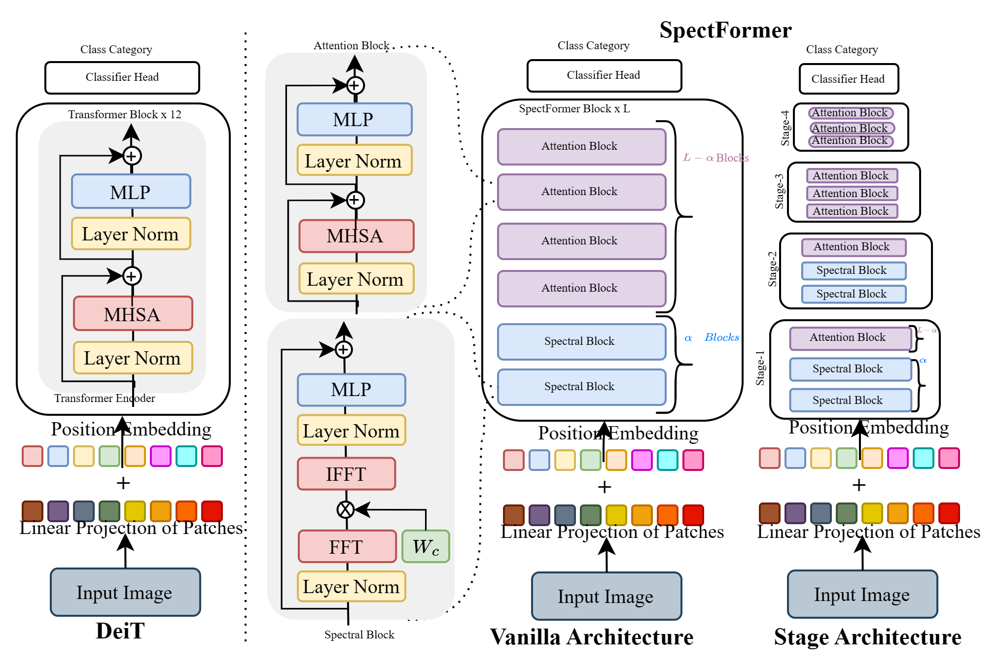
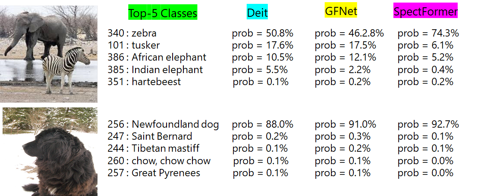

# SpectFormer: Frequency and Attention is what you need in a Vision Transformer


## Abstract

'''
Vision transformers have been applied successfully for image recognition tasks. There have been either multi-headed self-attention based (ViT \cite{dosovitskiy2020image}, DeIT, \cite{touvron2021training}) similar to the original work in textual models or more recently based on spectral layers (Fnet\cite{lee2021fnet}, GFNet\cite{rao2021global}, AFNO\cite{guibas2021efficient}). We hypothesize that both spectral and multi-headed attention plays a major role. We investigate this hypothesis through this work and observe that indeed combining spectral and multi-headed attention layers provides a better transformer architecture. We thus propose the novel Spectformer architecture for transformers that combines spectral and multi-headed attention layers. We believe that the resulting representation allows the transformer to capture the feature representation appropriately and it yields improved performance over other transformer representations. For instance, it improves the top-1 accuracy by 2\% on ImageNet compared to both GFNet-H and LiT. SpectFormer-S reaches 84.25\% top-1 accuracy on ImageNet-1K (state of the art for small version). Further, Spectformer-L achieves 85.7\% that is the state of the art for the comparable base version of the transformers. We further ensure that we obtain reasonable results in other scenarios such as transfer learning on standard datasets such as CIFAR-10, CIFAR-100, Oxford-IIIT-flower, and Standford Car datasets.  We then investigate its use in downstream tasks such of object detection and instance segmentation on MS-COCO dataset and observe that Spectformer shows consistent performance that is comparable to the best backbones and can be further optimized and improved. Hence, we believe that combined spectral and attention layers are what are needed for vision transformers.

'''



## Training

### Train SpectFormer for Vanilla Architecture 
```
bash vanilla_architecture/main.sh
```


### Train SpectFormer for Hierarchical Architecture 
```
bash hierarchical_architecture/main.sh
```

## Inference Results


# Acknowledgements
Thanks the contribution of [DeiT](https://github.com/facebookresearch/deit), [WaveVit](https://github.com/YehLi/ImageNetModel)  and [GFNet](https://github.com/raoyongming/GFNet).
